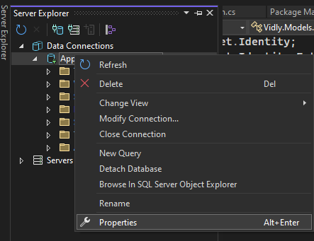
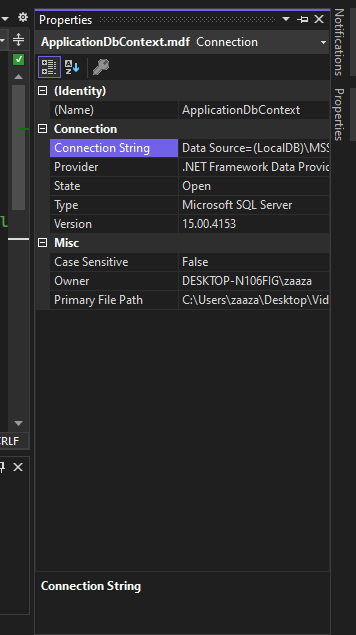

# Adding Identity to an asp.net MVC project without having user validation, authentication, or authorization.

when creating a new `asp.net MVC 5` project in earlier versions of **Visual Studio**, it's default Authentication is set to **Individual User Accounts** but if you are using newer version of **Visual Studio** you might not notice that the authentication is set to None as default and now you are facing the problem of how to add identity roles in my project. 
in this short guide i will hopefully try to help you to add *manually* the identity files rather than creating new project.

## New project

Create new `asp.net mvc 5` project and make sure to set the authentication to `Individual User Accounts`.

## Copy necessary files

Copy these files form the new project you just created and paste them in the same place in your original project.
> - From the **App_Start** folder the `IdentityConfig.cs` and `Startup.Auth.cs` files  add them to the **App_Start** folder of our project.
> - From the **Controllers** folder the `AccountController.cs` and_  `ManageController.cs` files  add them to the **Controllers** folder of our project.
> - From the **Models** folder the `AccountViewModels.cs`,_  `IdentityModels.cs` and  `ManageViewModels.cs` files  add them to the **Models** folder of our project.
> - From the **Views** folder, the `Accounts` and `Manager` folder and its contents _,_  add everything to the **Views** folder of our project.
> - From the folder `..\Views\Shared` the file  `_LoginPartial.cshtml`, `Error.cshtml`, `Lockout.cshtml` add them to our project in the folder `..\Views\Shared`
> - From the **root** of the project the file `Startup.cs` add it to the **root** of our project.

## Namespace

Change the _namespace_ to your real project _namespace_ for the files you just copied.

## Packages

if you have made it this far and tried to compile your code you will get some errors due to missing some packages which are added by default to the authenticated project you created

 here we have 3 options:

1- (Recommended) Just install the packages that are installed in the authenticated project you created.
* to view the list of installed packages type this command in your package manager console
`Get-Package | Format-Table -AutoSize`.

2- compile and for each error just google this error and you will find the name of the package you need to install.

3- try installing these packages
```
Install-Package EntityFramework
Install-Package Microsoft.AspNet.Identity.Core
Install-Package Microsoft.AspNet.Identity.EntityFramework
Install-Package Microsoft.AspNet.Identity.Owin
Install-Package Microsoft.AspNet.WebApi.Client
Install-Package Microsoft.Owin.Host.SystemWeb
```

## Database

now you need to update your database (if you have one).

so in your package manager console type `Add-Migration AddedIdentity` then `Update-Database`.

you should have some new tables in the last migration
>AspNetRoles
>AspNetUserRoles
>AspNetUsers
>AspNetUserClaims
>AspNetUserLogins

## Errors

there is two potential errors might happen

- a new database is created with extension `.mdf` and has all tables you created on this project.
	 - the solution is easy just change the connection string in the constructor of the _`ApplicationDbContext`_ class which you will find in  _`models/Identity.cs`_, replace `"DefaultConnection"` string to the **_connection string_** of your existing database that you work with.
	 
	  
	   
- a new database is created with extension `.sdf` and can't open it to see the tables.
	- this mistake happens due to install wrong package honstly i don't konw it so you might want to reset before installing packages and try installing again and try not to install that package causing this to happen.

## Refrences

i found this [guide](https://chiroldes.wordpress.com/2015/04/02/agregando-asp-net-identity-a-un-proyecto-mvc-sin-validacion-autenticacion-o-autorizacion-de-usuarios/comment-page-1/?unapproved=38&moderation-hash=0682a451f79f3ea799c95c485f418977#comment-38) in spanish but i encountered to the `.sdf` database problem and fixed it my own, also couldn't find anything gudie helping on the internet for 3 day until i found this guide by chance and that's why i'm creating this guide.
